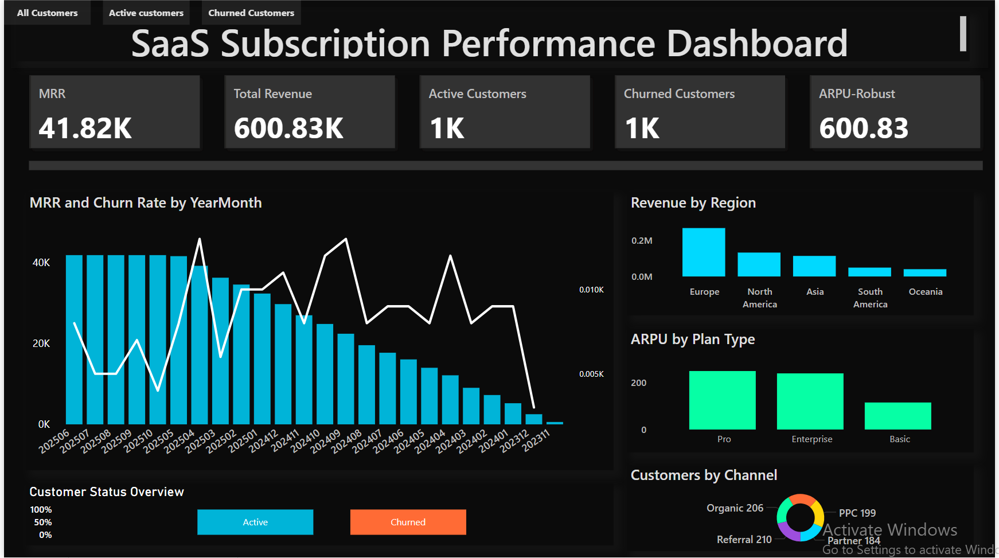
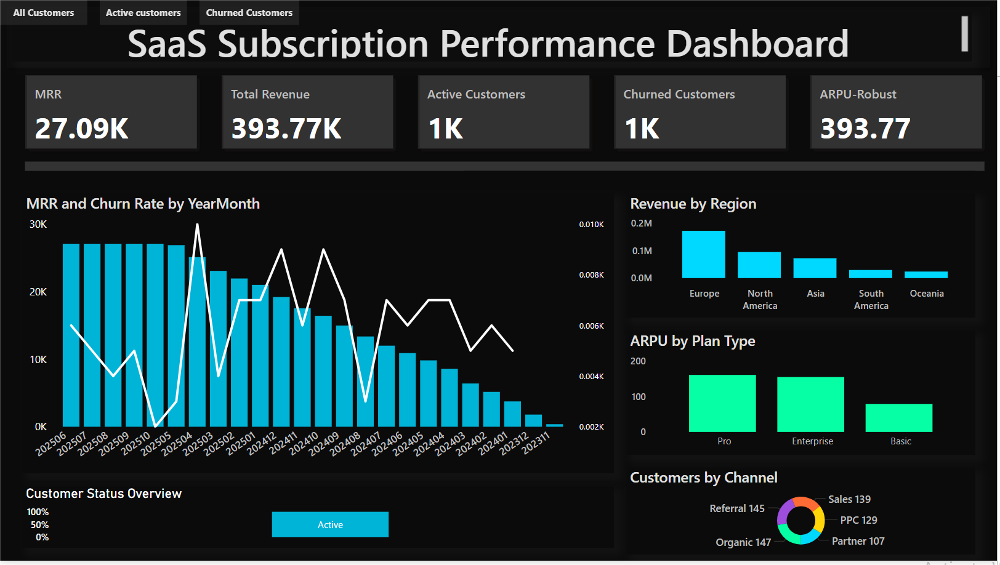
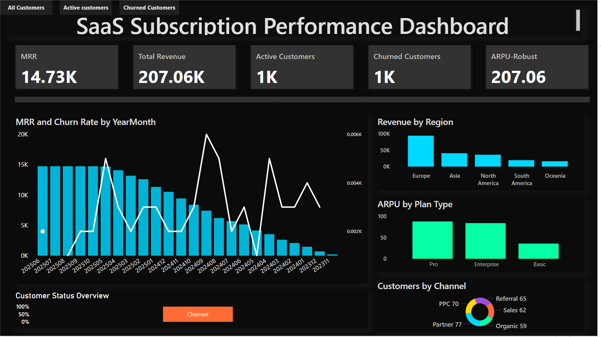

# 📊 SaaS Subscription Performance Dashboard — Power BI Project  

## 🧠 Project Objective  
To analyze **subscription revenue, customer churn patterns, and retention metrics** for a SaaS business using **Power BI**.  
This dashboard transforms subscription and payment data into actionable business insights for revenue optimization and customer retention strategies.

---

## 🧾 Dataset Details  
The dataset was **generated using SQL Server** with custom SQL queries to simulate realistic SaaS business data including:  

- **Customers** → CustomerID, Region, AcquisitionChannel (Organic, Referral, Sales, PPC, Partner)
- **Subscriptions** → SubscriptionID, PlanType (Pro/Enterprise/Basic), Customer Status (Active/Churned)  
- **Payments** → PaymentID, Amount, PaymentDate  
- **DimDate** → Date dimension table for time-series analysis  

**Data Generation:** SQL scripts created tables, populated them with synthetic transactional data, and established relationships.

**Data Connection:** SQL Server database connected to Power BI Desktop via SQL Server connector.

📄 **SQL Scripts:** Custom T-SQL queries written to generate 2,000+ customer records with payment history and subscription details.

---

## ⚙️ Data Modeling  
Star schema design with clean relationships:

| From | To | Relationship |
|------|----|---------------|
| `Customers[CustomerID]` | `Subscriptions[CustomerID]` | One-to-many |
| `Subscriptions[SubscriptionID]` | `Payments[SubscriptionID]` | One-to-many |
| `DimDate[Date]` | `Payments[PaymentDate]` | Many-to-one |

All tables cleaned and transformed in **Power Query** before loading to the data model.

---

## 📈 Key Performance Indicators (KPIs)

| KPI | Value | Description |
|-----|-------|-------------|
| **MRR** | 41.82K | Monthly Recurring Revenue |
| **Total Revenue** | 600.83K | Cumulative revenue from all payments |
| **Active Customers** | 1K | Customers with ongoing subscriptions |
| **Churned Customers** | 1K | Customers who cancelled subscriptions |
| **ARPU-Robust** | 600.83 | Average Revenue Per User |

Each KPI is displayed as a **Card visual** at the top of the dashboard.

---

## 📊 Dashboard Visuals  

### 1️⃣ KPI Cards (Top Row)
**Visuals:** 5 Card visuals  
- MRR (Monthly Recurring Revenue)
- Total Revenue  
- Active Customers  
- Churned Customers  
- ARPU-Robust  

**Design:**  
White text (#E0E0E0) • Bold • Center aligned  
Background: Black (#000000)  
Font: Segoe UI 16-18 pt  
Rounded corners with subtle shadow effects  

---

### 2️⃣ MRR and Churn Rate by YearMonth  
**Type:** Combo chart (Clustered column + Line)  
- X-axis → `DimDate[YearMonth]` (sorted chronologically)  
- Columns → MRR (Teal #00D9FF bars)  
- Line → Churn Rate (White line, width 2.5px)  
- Secondary Y-axis enabled for churn rate percentage  
- Title → *"MRR and Churn Rate by YearMonth"* (White, 14 pt)

**Purpose:** Track revenue growth trends against churn patterns over time to identify seasonal patterns and anomalies

---

### 3️⃣ Revenue by Region  
**Type:** Clustered Column chart  
- X-axis: Region (Europe, North America, Asia, South America, Oceania)  
- Y-axis: SUM(Payments[Amount])  
- Bar Color: Teal gradient (#00D9FF)  
- Title: *"Revenue by Region"*

**Purpose:** Geographic performance analysis for market expansion planning

---

### 4️⃣ ARPU by Plan Type  
**Type:** Clustered Column chart  
- X-axis: PlanType (Pro, Enterprise, Basic)  
- Y-axis: ARPU calculated measure  
- Bar Color: Mint Green (#06FFA5)  
- Title: *"ARPU by Plan Type"*

**Purpose:** Identify most profitable subscription tiers and pricing strategy effectiveness

---

### 5️⃣ Customers by Channel  
**Type:** Donut chart  
- Values: Customer count  
- Legend: AcquisitionChannel (Organic, Referral, Sales, PPC, Partner)  
- Center label: Total Customers with count
- Colors: Multi-color palette  
  - Purple (#9D4EDD) - Referral  
  - Yellow (#FFD60A) - PPC  
  - Cyan (#00D9FF) - Organic  
  - Orange (#FF6B35) - Sales  
  - Green (#06FFA5) - Partner  

**Purpose:** Evaluate effectiveness of marketing and acquisition channels

---

### 6️⃣ Customer Status Overview  
**Type:** Stacked Bar chart (Horizontal)  
- Segments: Active vs Churned  
- Data from `Customer Status` calculated column  
- Colors: Cyan #00D9FF (Active) / Orange #FF6B35 (Churned)  
- Shows percentage distribution with 100% bars

**Purpose:** Quick visual health check of customer base retention

---

### 7️⃣ Horizontal Divider Line
**Type:** Shape (Rectangle)  
- Position: Below KPI cards, above detailed charts  
- Color: Dark gray (#333333)  
- Height: 12px (minimum allowed in Power BI)  
- Width: Full dashboard width  
- Border: Disabled  

**Purpose:** Visual separation between metrics summary and detailed analytics

---

## 🎯 Interactive Bookmark Navigation  

**3 Bookmark Buttons for instant filtering:**

| Button | Action | Design |
|--------|--------|--------|
| **All Customers** | Display complete dataset (2,000+ customers) | Dark gray (#333333) default, Cyan (#00D9FF) on hover |
| **Active Customers** | Filter to show only active subscribers | Dark gray (#333333) default, Cyan (#00D9FF) on hover |
| **Churned Customers** | Filter to analyze churn patterns only | Dark gray (#333333) default, Cyan (#00D9FF) on hover |

**Implementation:**  
- Power BI Bookmarks + Buttons feature  
- Applied filters at page level for each bookmark state  
- Hover effects with color transition  
- Instant visual updates across all charts and KPIs  

**User Experience:** Clicking any button instantly updates all visuals and KPIs based on selected customer segment

---

## 🖌️ Dashboard Design Theme  

| Element | Style |
|----------|--------|
| **Background** | Black (#000000) |
| **Primary Accent** | Teal/Cyan (#00D9FF) |
| **Churn/Warning Color** | Orange (#FF6B35) |
| **Success/Active Color** | Mint Green (#06FFA5) |
| **Referral Channel** | Purple (#9D4EDD) |
| **PPC Channel** | Yellow (#FFD60A) |
| **Font** | Segoe UI (White #E0E0E0) |
| **Card Backgrounds** | Dark with subtle effects |
| **Divider Line** | Dark gray (#333333), 12px height |
| **Gridlines** | Disabled for clean look |
| **Title Font Size** | 14–16 pt Bold |
| **Alignment** | Even spacing with grid layout |

**Design Philosophy:** Modern dark theme with vibrant accent colors for high contrast and improved readability during extended analysis sessions.

---

## 💡 Key DAX Measures

**Total Revenue**
Total Revenue = SUM(Payments[Amount])

text

**MRR (Monthly Recurring Revenue)**
MRR =
CALCULATE(
SUM(Payments[Amount]),
Payments[PaymentDate] = MAX(Payments[PaymentDate])
)

text

**ARPU (Average Revenue Per User)**
ARPU =
DIVIDE(
[Total Revenue],
DISTINCTCOUNT(Customers[CustomerID])
)

text

**Churn Rate**
Churn Rate =
DIVIDE(
COUNTROWS(FILTER(Subscriptions, Subscriptions[Customer Status] = "Churned")),
COUNTROWS(Subscriptions)
)

text

**Active Customers**
Active Customers =
CALCULATE(
DISTINCTCOUNT(Subscriptions[SubscriptionID]),
Subscriptions[Customer Status] = "Active"
)

text

**Churned Customers**
Churned Customers =
CALCULATE(
DISTINCTCOUNT(Subscriptions[SubscriptionID]),
Subscriptions[Customer Status] = "Churned"
)

text

**Customer Status (Calculated Column)**
Customer Status =
IF(
MOD(Subscriptions[SubscriptionID], 3) = 0,
"Churned",
"Active"
)

text

---

## 💡 Business Insights  

- MRR demonstrates consistent growth trajectory reaching 41.82K  
- Churn rate patterns reveal opportunities for retention improvement strategies  
- **Organic (206)** and **Referral (210)** channels deliver highest customer acquisition volumes  
- **Sales channel** provides steady contribution to customer base  
- **PPC (199)** and **Partner (184)** channels show balanced performance  
- Revenue distribution shows strong performance across all 5 global regions  
- 50-50 split between active and churned customers indicates significant retention opportunity  
- Enterprise and Pro plan types demonstrate strong ARPU performance above 600+  
- Time-series analysis reveals seasonal patterns in both revenue and churn  

---

## 🧰 Tools & Technologies Used  
- **SQL Server** → Database creation and synthetic data generation  
- **T-SQL** → Writing custom queries to generate realistic SaaS business scenarios  
- **Power BI Desktop** → Dashboard design, development, and visualization  
- **DAX (Data Analysis Expressions)** → Custom measures, calculations, and business logic  
- **Power Query (M language)** → Data transformation, cleaning, and preparation  
- **SQL Server Connector** → Direct connection from Power BI to SQL Server database  
- **Power BI Service** → Cloud publishing, sharing, and collaboration  
- **Bookmarks & Buttons** → Interactive navigation and filtering system  
- **Star Schema Modeling** → Optimized data architecture for performance  
- **GitHub** → Portfolio hosting, version control, and project documentation  

---

## 🚀 Live Interactive Dashboard  

**🔗 [Click Here to View Live Dashboard](https://app.powerbi.com/view?r=eyJrIjoiODYyNDYxY2ItODA3OC00MGNmLWExMjYtN2MwNzM3MmFhOGRhIiwidCI6IjgzMTQwNmUwLWQ2ZmEtNGY3Zi1hODY0LTc1MWZhNTdmYTdkNyJ9)**  

Experience the full interactive dashboard in your browser — click bookmark buttons, hover for tooltips, and cross-filter between visuals. No software installation required!

---

## 📂 Repository Contents  

| File Name | Description |
|------------|-------------|
| `SaaS-Subscription-Dashboard.pbix` | Complete Power BI report file with all visuals, data model, and measures |
| `dashboard-overview.png` | Full dashboard screenshot showing all visuals |
| `active-customers.png` | Dashboard view filtered to active customers only |
| `churned-customers.png` | Dashboard view filtered to churned customers only |
| `README.md` | This comprehensive project documentation |

---

## 🎓 Skills Demonstrated  

✅ **SQL Database Design** — Table creation, relationships, and data generation  
✅ **T-SQL Programming** — Query writing for synthetic data simulation  
✅ **Business Intelligence & Analytics** — Understanding of SaaS KPIs and subscription metrics  
✅ **Data Modeling** — Star schema design with optimized fact and dimension tables  
✅ **Advanced DAX** — Complex calculations, filtering, and measure creation  
✅ **Data Visualization** — Strategic chart type selection for data storytelling  
✅ **UX/UI Design** — User-centered dashboard layout with visual hierarchy  
✅ **Color Theory** — Accessible color palette with meaningful associations  
✅ **Interactive Design** — Bookmarks, buttons, cross-filtering, and hover effects  
✅ **Power Query** — ETL processes and data transformation  
✅ **Technical Documentation** — Comprehensive project documentation and README creation  
✅ **Cloud Publishing** — Power BI Service deployment and sharing  

---

## 🚀 Outcome  

A **recruiter-ready Power BI dashboard** that tracks subscription revenue, MRR growth, customer churn patterns, ARPU trends, and multi-channel acquisition performance — demonstrating professional-level skills in **SQL database design, T-SQL programming, data modeling, DAX programming, interactive bookmark navigation, and modern dashboard design principles**.

This project showcases the complete end-to-end BI development lifecycle: **SQL data generation → Database design → Power BI connection → Dashboard creation → Interactive features → Cloud publishing** — making it an ideal portfolio piece for Data Analyst, Business Intelligence Analyst, and Power BI Developer roles.

---

## 🏁 Dashboard Preview  

### Interactive Bookmark Views

**Active Customers View**  

**Churned Customers View**  

---
## 🙏 Acknowledgments  

- Built as part of Power BI portfolio to demonstrate end-to-end business intelligence capabilities  
- Data generated using custom SQL Server scripts for realistic SaaS business simulation  
- Designed following Microsoft Power BI best practices and accessibility guidelines  
- Color palette inspired by modern SaaS application design principles  
- Interactive bookmark functionality demonstrates advanced Power BI navigation features  

